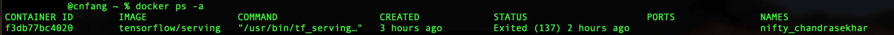
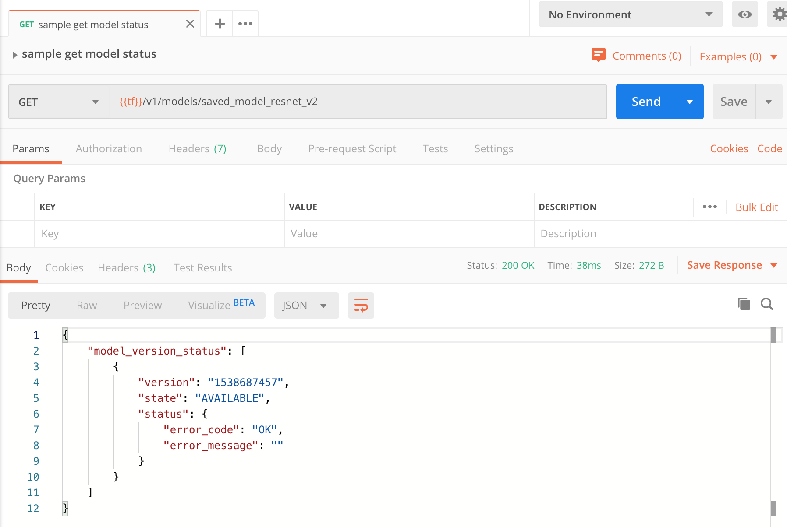

# This repository shows deploying Tensorflow model using Docker

TensorFlow provides an easy way to deploy well-trained model on Docker. To do that, the trained model must comply with TensorFlow SavedModel format [here](https://github.com/tensorflow/tensorflow/blob/master/tensorflow/python/saved_model/README.md). SaveModel acts as outer mounted source for Tensorflow server, we can add as many models as we want.


## Step 0: Train a model with TensorFlow
[TODO]


## Step 1: Convert well-trained model to SavedModel
[TODO]


## Step 2: Deploy SavedModel on TensorFlow Serving System with Docker

### Materials required: 
Note that below pretrained models are download from tensorflow github
- Model: folder of my models is organized below:
allmodels
├── models.config
├── saved_model_half_plus_three
│   └── 00000123
│       ├── assets
│       │   └── foo.txt
│       ├── saved_model.pb
│       └── variables
│           ├── variables.data-00000-of-00001
│           └── variables.index
├── saved_model_half_plus_two_cpu
│   └── 00000123
│       ├── assets
│       │   └── foo.txt
│       ├── saved_model.pb
│       └── variables
│           ├── variables.data-00000-of-00001
│           └── variables.index
└── saved_model_resnet_v2
    └── 1538687457
        ├── saved_model.pb
        └── variables
            ├── variables.data-00000-of-00001
            └── variables.index

- Configuration file for serving multi-models: models.config
```
model_config_list: {
  config: {
    name: "saved_model_half_plus_three",
    base_path: "/models/allmodels/saved_model_half_plus_three",
    model_platform: "tensorflow"
  },
  config: {
    name: "saved_model_half_plus_two_cpu",
    base_path: "/models/allmodels/saved_model_half_plus_two_cpu",
    model_platform: "tensorflow"
  },
  config: {
    name: "saved_model_resnet_v2",
    base_path: "/models/allmodels/saved_model_resnet_v2",
    model_platform: "tensorflow"
  }
}
```

### Instructions
see [official](https://www.tensorflow.org/tfx/serving/docker) for details. I just cover instruction here:

1. Install Docker
see official doc

2. Download TensorFlow Serving image to Docker and Create container for accepting request

```
# Download the TensorFlow Serving Docker image and repo
docker pull tensorflow/serving

# Start TensorFlow Serving container and open the REST API port
docker run -p 8501:8501 --mount type=bind,source=${path-to-model-folder}/allmodels/,target=/models/allmodels -t tensorflow/serving --model_config_file=/models/allmodels/models.config
```

Note that
> -p 8501:8501 
publish the container's port 8501 to host's port 8501 (Port 8500 exposed for gRPC, Port 8501 exposed for REST API)

> --mount type=bind, source=... ,target=... 
mount the local source folder on the container for TF serving to read the models.
target is the model base path on the container (default /models)

> -t tensorflow/serving  
running a docker container with docker image "tensorflow/serving"

> --model_config_file
Tensorflow Serving System provides several ways to configure server [here](https://www.tensorflow.org/tfx/serving/serving_config) model_config_file is to pecify model names and paths

## Step 3: Send Request to TensorFlow Serving System with Postman and Python script
Once container is created successfully, we could check container status via
> docker ps -a


### Send request to regression model via Postman
[TensorFlow Serving API](https://www.tensorflow.org/tfx/serving/api_rest)
REST API Request format
> http://host:port/v1/models/${MODEL_NAME[/versions/${MODEL_VERSION}]:(classify|regress)

- check model "saved_model_resnet_v2" status by sending get request as below 
> GET http://localhost:8501/v1/models/saved_model_resnet_v2


- get metadata of model by sending get request
> GET http://localhost:8501/v1/models/saved_model_half_plus_three/metadata


- get prediction result
> POST http://localhost:8501/v1/models/saved_model_half_plus_three:predict


- get regression result
> POST http://localhost:8501/v1/models/saved_model_half_plus_three:regress


### Send request along with image to classification model via Python Script
Tensorflow provides examples to send image to the server, download a script "resnet_client.py" here [download](https://github.com/tensorflow/serving/tree/master/tensorflow_serving/example/resnet_client.py)

1. go to line 39 and change SEVER_URL to 
> SERVER_URL = 'http://localhost:8501/v1/models/saved_model_resnet_v2:predict'

2. execute this script via below
```
# anaconda create virtual enviroment for installing tensorflow library, here my enviroment is named "tensorflow"
conda activate tensorflow

# execute this script (image url is specified in script)
python restnet_client.py 

# Result
# Prediction class: 286, avg latency: 210.05699999999996 ms
```
*Note that image sent to server must be encoded with base64*
RestNet is trained by ImageNet dataset, label category records the category name [here](https://gist.github.com/yrevar/942d3a0ac09ec9e5eb3a)

3. (optional) format of model input/output can be observed by SavedModel Command Line Interface (CLI)
see [here](https://www.tensorflow.org/guide/saved_model#saved_model_cli) for more details
```
# activate conda environment
conda activate tensorflow

# show format of model input/output
cd path-to-model
saved_model_cli show --dir $(mypath)/allmodels/ssaved_model_half_plus_three/00000123 --all
# result as below
```


## Addtional Information

- Docker command
```
# stop container 
docker stop [container name or container ID]

# remove container
docker rm [container name or container ID]

# list existing container
docker ps -a

# see a list of images
docker images
```

- Anaconda Environment
python 3.6
tensorflow 1.9


